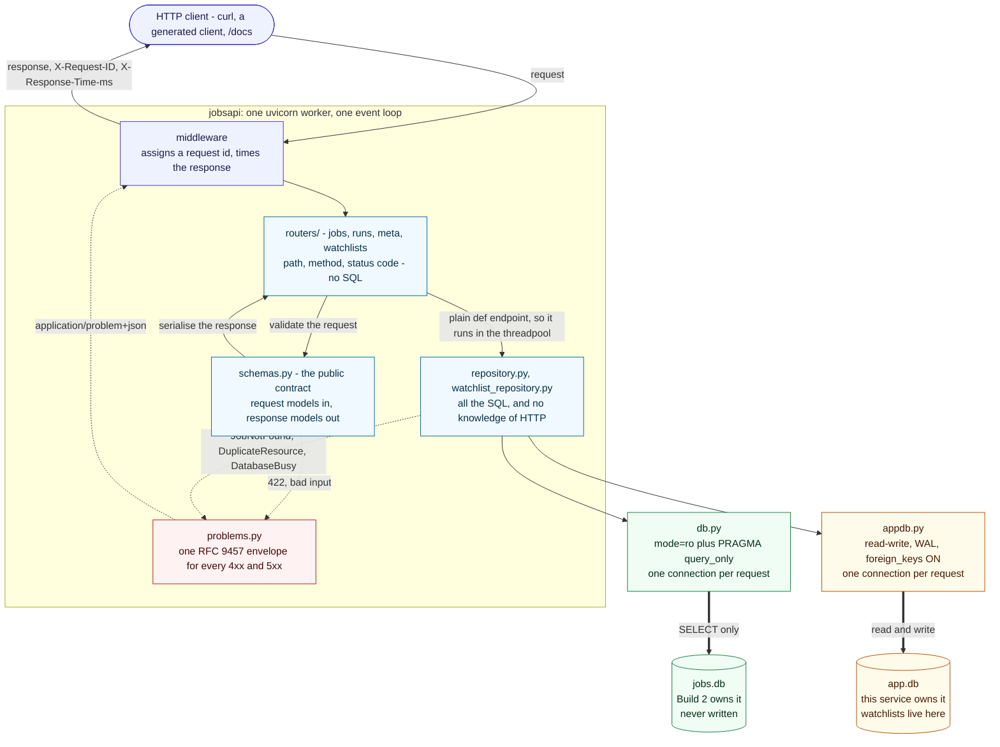

# Job Listings API

[](https://github.com/professor3333/job-listings-api/actions/workflows/ci.yml)

A **FastAPI** service over a scraped job-listings SQLite dataset, with input
validation that is part of the type system rather than a layer of checks bolted
on top.

It **reads** Build 2's dataset and **never writes to it**. Watchlists — the one
thing you can create here — live in a separate database this service owns.

The dataset comes from `job-listing-scraper` (Build 2) — more than 5,000 jobs
across 8 sources, with scrape-run history and field-level change tracking.
`/stats` is the live count. **That repository is private, so this one is written
to stand on its own:** everything you need to run, test and understand this
service is here, and `scripts/make_demo_db.py` builds a working database from
scratch without it. This service does not scrape anything. It reads that
database, never writes to it, and exposes it as JSON.

---

## The problem

Build 2 left its listings in a single SQLite file on one laptop — 3,498 rows in
64 MB when this build started on 2026-09-01, 5,276 in 85 MB by 2026-09-05, and
growing every time the scraper runs. That file is a dead end for anyone who is
not sitting in front of it:

- **Only one machine can use it.** There is no way to query it from a script, a
  notebook, a phone, or another person's computer without copying the file — and
  a copy is stale the moment the scraper next runs.
- **Reading it requires knowing the schema.** `remote` is a nullable integer
  where `NULL` means "never established" rather than "no". `salary_min` is absent
  in roughly three quarters of rows. Anyone querying the file directly has to
  rediscover those facts, and will get them wrong in a way that produces
  plausible numbers.
- **Handing someone the file hands them a writable copy.** Nothing stops an
  accidental `DELETE` against the dataset the scraper spent days building.
- **The file is live.** The scraper takes an `EXCLUSIVE` lock during its commits,
  so a naive reader intermittently fails with `database is locked` — and the
  distinct case where a crashed writer left a hot journal cannot be fixed by
  retrying at all.
- **Some columns are far too big to hand back casually.** Descriptions average
  5.4 KB and reach 33 KB; the change history holds single values of 30,646
  characters. A careless list endpoint returns megabytes nobody asked for.

**So the job is to turn a private, locked, schema-coupled file into something any
HTTP client can query safely** — and the hard part is not the endpoints. It is
the **contract**: what a client is allowed to send, what it gets back, and what
happens when it sends nonsense.

That contract has to answer questions the file itself never had to:

| Question the file never had to answer | The answer here |
|---|---|
| What happens on `?limit=1000`? | `422`, naming the field and the rule — never silently clamped |
| Does `salary_min_gte=100000` include rows with no salary? | No — documented, because it governs roughly three quarters of the data |
| What does `?sort=id;DROP TABLE jobs` do? | `422` from an enum allowlist; an identifier can never be a bound parameter |
| What comes back while the scraper holds the lock? | `503` with `Retry-After` — and a *different* `503` without one when retrying cannot help |
| What does a client see when something genuinely breaks? | `500` with an opaque body and a `request_id`; the traceback goes to the log, never the response |

The exit criterion for this build was one sentence: **"the API returns correct
JSON and rejects bad input, and every line is explained."**

---

## Architecture

The point of this build is the **contract**: what goes in, what comes out, and
what happens when someone sends garbage. The layout enforces it.



Read it as two claims. **Downwards**, each layer knows only the one beneath it —
a router never sees SQL and a repository never sees HTTP. **Sideways**, the two
databases are reached through different modules with different modes, so the
write path cannot touch the read database even by mistake.

Four rules hold it together:

- **A router contains no SQL.** A `SELECT` in `routers/` means the boundary broke.
- **The repository raises no `HTTPException`.** It raises `JobNotFound`; the
  application translates that to a 404 at its edge. That is why the repository is
  testable without starting an app.
- **Every endpoint declares a `response_model`.** An undeclared field cannot
  leak — which is how `description` (avg 5.4 KB, max 33 KB) stays out of list
  responses structurally rather than by vigilance.
- **No global connection.** One connection per request, opened by a dependency
  and closed after, even when the endpoint raised.

### The design decisions worth knowing before reading the code

**The service never writes to `jobs.db`.** Enforced at the connection with a
`mode=ro` URI and `PRAGMA query_only = 1` — two independent places, so changing
one does not silently remove the guarantee. Not by intention, and not by review.

**Errors use one envelope: RFC 9457 problem details**, served as
`application/problem+json`, with a machine-readable `code` and a `request_id`
that ties the response to a line in the log. FastAPI's defaults return *two*
incompatible shapes (`detail` is a list of objects for a validation error and a
bare string for an `HTTPException`), and a client cannot write one handler
against that.

**Validation failures are `422`, never `400`** — including cross-field ones like
`salary_min_gte > salary_max_lte`. `422` is *Unprocessable Content*: syntax
understood, instructions not followable. The distinction a client can act on is
carried in the body (`VALIDATION_FAILED` vs `CROSS_FIELD_CONFLICT`), not in the
status line.

**Endpoints that touch SQLite are plain `def`, not `async def`.** `sqlite3`
blocks. FastAPI runs a `def` endpoint in a threadpool, so the blocking read
occupies a worker thread and the event loop stays free; an `async def` endpoint
runs *on* the loop, where one query stalls every concurrent request in the
process. `/health` is `async def` because it does no I/O at all. This is the
single most common way to build a FastAPI app that tests perfectly and collapses
under two users.

**`sort` is an allowlist, not a column name.** A value can be a bound parameter;
an identifier cannot — `ORDER BY ?` is not valid SQL. So the column is *chosen*
from a six-member enum written in our own source. `?sort=id;DROP TABLE jobs` is a
422 from enum validation and never reaches the repository.

**Pagination has a tie-break.** `ORDER BY posted_at DESC` alone is not a total
order — hundreds of rows share a date, and `LIMIT`/`OFFSET` over an unstable
sort silently repeats some rows and skips others. Every sort ends `, id`.

**NULL never satisfies a filter.** `salary_min_gte=100000` excludes rows with no
recorded salary, which is roughly three quarters of them. This is a documented
decision, not an accident of SQL — see [`docs/api.md`](docs/api.md#decision-null-values-never-satisfy-a-filter).
The opposite call is made one field over: `remote` is tri-state, and
`remote=unknown` means `IS NULL`, because NULL there records that the scraper
never established the fact — collapsing it to `false` would invent data.

**Writes go to a second database, and `409` is not `422`.** A duplicate
watchlist name is a `409 Conflict`: the body was valid and the identical request
would have succeeded a minute earlier, so what refused it is the *state*, not the
input. The duplicate is detected by the `UNIQUE` constraint rather than a prior
`SELECT`, because check-then-insert is a race two concurrent requests both win.

**`PUT` replaces, `PATCH` merges.** An omitted `description` is *cleared* by
`PUT` and *left alone* by `PATCH`. The mechanism is `model_dump(exclude_unset=True)`:
without it, every unsent field arrives as its default `None` and a rename
silently wipes the description — the most common way a `PATCH` endpoint is
written wrong.

**A watchlist's job reference can dangle.** `watchlist_items.job_id` has no
foreign key and cannot have one, because the row lives in a different database
file. It is checked when written, so a job later removed from `jobs.db` leaves an
entry pointing at nothing — reported as `job_missing: true` rather than hidden,
since a client that saved it needs to see it to clean it up.

The full reasoning, including the options rejected and the measurements behind
them, is in [`docs/design.md`](docs/design.md) and [`docs/api.md`](docs/api.md).

---

## Features

- Filtering on 12 query parameters, combining with `AND`
- Sorting on an allowlisted column, `asc`/`desc`, with a stable tie-break
- Pagination with `total`, so a client can tell it has reached the end
- Tri-state `remote` filter that honours `NULL` as its own answer
- Cross-field validation (`salary_min_gte`/`salary_max_lte`, `posted_after`/`posted_before`)
- Unknown query parameters rejected, not ignored — `?colour=red` is a 422
- One RFC 9457 error envelope for every 4xx and 5xx
- Field-level edit history per job, truncated in SQL rather than in the response
- Dataset statistics: row counts, per-field null coverage, tri-state split
- Structured JSON logging with a request id, plus `X-Request-ID` and
  `X-Response-Time-ms` on every response
- Loud startup failure if the database is missing or its schema has drifted
- Distinct handling for a *busy* database (503, retryable) and a *wedged* one
  (503, explicitly not retryable)
- Watchlists: create, list, replace, patch, delete, and add or remove jobs —
  written to a **separate database**, with `201`+`Location`, `409` on duplicates
  and `204` on delete
- An optional single API key on the watchlist endpoints, off unless configured
- OpenAPI docs generated from the types, at `/docs`

## Tech stack

Python 3.13 · FastAPI · Pydantic v2 · pydantic-settings · uvicorn · stdlib
`sqlite3` · pytest · ruff · uv.

**No ORM and no migrations**, deliberately: this service does not own the schema,
and the framework's hidden work has to be visible once before a framework is
allowed to hide it.

## Project structure

```
src/jobsapi/
├── main.py            app factory, middleware, lifespan — no business logic
├── config.py          settings from JOBSAPI_* env vars
├── db.py              read connection per request, mode=ro, schema check
├── appdb.py           the database this service owns: read-write, WAL, FK on
├── security.py        the optional X-API-Key dependency
├── schemas.py         Pydantic request + response models = the contract
├── repository.py      all the SQL for the read database
├── watchlist_repository.py   all the SQL for the write database
├── errors.py          domain exceptions (JobNotFound, DatabaseWedged, ...)
├── problems.py        RFC 9457 envelope and every exception handler
├── logging_config.py  JSON formatter, request-id ContextVar
└── routers/
    ├── jobs.py        /jobs, /jobs/{id}, /jobs/{id}/changes
    ├── runs.py        /runs
    ├── watchlists.py  the write path
    └── meta.py        /health, /sources, /stats
tests/                 TestClient only — no network, no real database
scripts/
└── make_demo_db.py    a small database with Build 2's schema, for demos and CI
docs/                  design.md (the decisions), api.md (the contract)
learning_log/          how the build was reasoned about, and where it went wrong
```

## Requirements

- Python 3.13
- [uv](https://docs.astral.sh/uv/) for dependency management
- A copy of the scraper's `jobs.db` — or the bundled demo database (below)

## Installation

```bash
git clone https://github.com/professor3333/job-listings-api.git
cd job-listings-api
uv sync
```

## Configuration

All settings are environment variables with a `JOBSAPI_` prefix.

| Variable | Default | What it does |
| -------- | ------- | ------------ |
| `JOBSAPI_DB_PATH` | `~/code/job-listing-scraper/data/jobs.db` | Path to the SQLite database to read. Opened read-only. |
| `JOBSAPI_BUSY_TIMEOUT_MS` | `5000` | How long SQLite waits on a lock before raising `SQLITE_BUSY`, which becomes a `503`. Never a hang. |
| `JOBSAPI_CACHE_SIZE_KIB` | `-8000` | Page cache per connection. Negative means KiB, SQLite's convention. |
| `JOBSAPI_LOG_LEVEL` | `INFO` | Root log level. |
| `JOBSAPI_APP_DB_PATH` | `~/.local/share/jobsapi/app.db` | The database this service **owns and writes to**. Created if absent. Never the same file as `JOBSAPI_DB_PATH`. |
| `JOBSAPI_API_KEY` | *(unset)* | When set, every `/watchlists` request must carry an `X-API-Key` header. Unset leaves them open. |

The database path is **a path, not a policy**: pointing it at a snapshot rather
than the live scraper database is a deployment choice, and no code branches on it.

There is deliberately no setting for the maximum page size. The `1..100` bound on
`limit` is a `Field` constraint that `/openapi.json` publishes, so making it
configurable would let a deployment's real bound differ from what the generated
docs promise.

## Usage

If you have the scraper's database at the default path:

```bash
uv run uvicorn jobsapi.main:app --reload
```

If you don't, build the demo database first — five rows chosen to include the
awkward cases (null salary, null `remote`, a unicode company, an apostrophe in a
title, a null `posted_at`):

```bash
uv run python scripts/make_demo_db.py data/demo.db
JOBSAPI_DB_PATH=data/demo.db uv run uvicorn jobsapi.main:app --reload
```

Then open **<http://127.0.0.1:8000/docs>** — the Swagger UI is the entire
front end, and it is generated from the type hints, so it cannot drift from the
implementation.

The examples below are all against the demo database.

```bash
curl http://127.0.0.1:8000/health
# {"status":"ok"}

curl 'http://127.0.0.1:8000/jobs?limit=2&sort=posted_at&order=desc'
# {"items":[...],"total":5,"limit":2,"offset":0}

curl 'http://127.0.0.1:8000/jobs?remote=unknown'
# the tri-state filter: NULL is its own answer, not False

curl 'http://127.0.0.1:8000/jobs?salary_min_gte=100000&currency=usd'
# currency is matched uppercase; rows with no recorded salary are excluded

curl 'http://127.0.0.1:8000/jobs?q=100%25'
# '%' is escaped before it reaches LIKE and matched literally

curl http://127.0.0.1:8000/jobs/1/changes
# edit history; long values truncated at 200 chars with the true length reported

curl http://127.0.0.1:8000/sources
curl 'http://127.0.0.1:8000/runs?limit=3'
curl http://127.0.0.1:8000/stats
```

Creating something — the write path:

```bash
# 201, with a Location header naming the new resource
curl -i -X POST http://127.0.0.1:8000/watchlists \
  -H 'content-type: application/json' \
  -d '{"name": "Backend roles", "description": "EU only"}'
# HTTP/1.1 201 Created
# location: /watchlists/1

# 409 — the body is fine, the state refuses it
curl -X POST http://127.0.0.1:8000/watchlists \
  -H 'content-type: application/json' -d '{"name": "Backend roles"}'

# add a job; 404 if the job does not exist, 409 if it is already on the list
curl -X POST http://127.0.0.1:8000/watchlists/1/jobs \
  -H 'content-type: application/json' \
  -d '{"job_id": 3, "note": "apply monday"}'

curl http://127.0.0.1:8000/watchlists/1/jobs   # job details joined in

# PATCH merges: description survives
curl -X PATCH http://127.0.0.1:8000/watchlists/1 \
  -H 'content-type: application/json' -d '{"name": "Backend roles EU"}'

# PUT replaces: the omitted description is CLEARED
curl -X PUT http://127.0.0.1:8000/watchlists/1 \
  -H 'content-type: application/json' -d '{"name": "Backend roles EU"}'

curl -i -X DELETE http://127.0.0.1:8000/watchlists/1   # 204, empty body
```

That `PATCH`/`PUT` pair is the whole distinction: the same body, and one keeps
`description` while the other clears it.

Bad input, and what it looks like:

```bash
curl -i 'http://127.0.0.1:8000/jobs?limit=0'
```

```
HTTP/1.1 422 Unprocessable Content
content-type: application/problem+json
x-request-id: beeb0aec8b6348eba1a864091b1e7a16
x-response-time-ms: 1.4
```

(Headers abridged. `x-request-id` and `x-response-time-ms` differ on every
request — the id is the value to quote when reporting a failure, because it is
what finds the matching line in the log.)

```json
{
  "type": "about:blank",
  "title": "Validation failed",
  "status": 422,
  "detail": "Input should be greater than or equal to 1",
  "instance": "/jobs",
  "code": "VALIDATION_FAILED",
  "errors": [
    {
      "field": "limit",
      "rule": "greater_than_equal",
      "message": "Input should be greater than or equal to 1"
    }
  ],
  "request_id": "beeb0aec8b6348eba1a864091b1e7a16"
}
```

The `errors[]` array names the exact parameter and the rule it broke, so a client
never has to guess which of twelve filters was wrong.

## API reference

| Method | Path | Success | Response model |
| ------ | ---- | ------- | -------------- |
| GET | `/health` | `200` | `Health` — liveness only; touches no database |
| GET | `/jobs` | `200` | `JobPage` — `{items, total, limit, offset}` |
| GET | `/jobs/{job_id}` | `200` | `JobDetail` — the only place `description` is served |
| GET | `/jobs/{job_id}/changes` | `200` | `JobChangePage` — field-level edit history |
| GET | `/sources` | `200` | `list[SourceSummary]` — counts and last run status |
| GET | `/runs` | `200` | `RunPage` — scrape run history, with a nullable `duration_seconds` |
| GET | `/stats` | `200` | `Stats` — counts, null coverage, tri-state split |

**`duration_seconds` is null when unknown, never zero.** Until 2026-09-02 the
scraper stamped both ends of a run from one clock reading, so most historical
runs have `finished_at` exactly equal to `started_at`. That is reported as
`null` rather than `0.0`, because a confident zero would read as "scrapes are
instantaneous" and nothing else in the response would contradict it. Runs still
in progress are null too. Both raw timestamps are always returned, so you can
check the arithmetic yourself. See `docs/api.md` for the full reasoning.

### Watchlists (the write path)

| Method | Path | Success | Notes |
| ------ | ---- | ------- | ----- |
| POST | `/watchlists` | `201` | `Location` header; `409` on a duplicate name |
| GET | `/watchlists` | `200` | `WatchlistPage` |
| GET | `/watchlists/{id}` | `200` | `404` when absent |
| PUT | `/watchlists/{id}` | `200` | Full replacement; omitted fields are cleared; never creates |
| PATCH | `/watchlists/{id}` | `200` | Partial; `422` on an empty body |
| DELETE | `/watchlists/{id}` | `204` | `404` if already gone; cascades to items |
| POST | `/watchlists/{id}/jobs` | `201` | `404` unknown job, `409` already on the list |
| GET | `/watchlists/{id}/jobs` | `200` | Job details joined from the read database |
| DELETE | `/watchlists/{id}/jobs/{job_id}` | `204` | `404` if not on the list |

Every response carries `X-Request-ID` and `X-Response-Time-ms`.

### `GET /jobs` query parameters

| Param | Type | Rule | Default |
| ----- | ---- | ---- | ------- |
| `limit` | int | `1..100`. Out of range is **422, not clamped**. | `20` |
| `offset` | int | `>= 0`. Past the end is `200` with `items: []`. | `0` |
| `q` | str | ≤ 200 chars. Substring of title **or** company, case-insensitive. `%` and `_` matched literally. | — |
| `source` | enum | One of the 8 known sources. | — |
| `company` | str | ≤ 200 chars. **Prefix** match, case-insensitive. | — |
| `remote` | enum | `true` / `false` / `unknown`. | — |
| `seniority` | enum | `intern`, `junior`, `senior`, `staff`, `lead`, `principal`, `head`, `director`. | — |
| `salary_min_gte` | int | `>= 0`. Matches `salary_min >= value`. | — |
| `salary_max_lte` | int | `>= 0`. Matches `salary_max <= value`. | — |
| `currency` | str | ISO 4217, 3 letters. Case-insensitive, matched uppercase. | — |
| `posted_after` | date | ISO `YYYY-MM-DD`, inclusive. | — |
| `posted_before` | date | ISO `YYYY-MM-DD`, inclusive. | — |
| `sort` | enum | `posted_at`, `id`, `company`, `title`, `salary_min`, `salary_max`. | `posted_at` |
| `order` | enum | `asc` / `desc`. | `desc` |

Filters combine with `AND`. Unknown parameters are **rejected with 422**, on the
grounds that `?limt=5` silently returning unfiltered results is a worse failure
than an error message.

### Status codes

| Code | When | Why not something else |
| ---- | ---- | ---------------------- |
| `200` | Success, **including an empty list** | An empty result answers a reasonable question. `404` would mean the endpoint does not exist. |
| `404` | `/jobs/{id}` matches no row | The *resource* is absent. Never used for an empty collection. |
| `405` | A write method against a read-only path | The path exists; the method does not apply. |
| `422` | Any input the service will not act on | Malformed *and* cross-field. See the design note above. |
| `500` | An unhandled fault | Body says nothing; the traceback goes to the log under the same `request_id`. |
| `201` | A resource was created | Carries `Location`. |
| `204` | A delete succeeded | No body, deliberately. |
| `401` | A configured API key was missing or wrong | Not `403` — that means *authenticated but forbidden*, and there is no identity here to forbid. |
| `409` | A uniqueness constraint refused the write | Not `422` — the body was valid; the current state refused it. |
| `503` | The database is locked or wedged | The service is fine; its dependency is not. `DATABASE_BUSY` carries `Retry-After`; `DATABASE_UNAVAILABLE` deliberately does not, because a wedged database cannot be fixed by retrying. |

Every 4xx and 5xx uses the same envelope, with these `code` values:
`VALIDATION_FAILED`, `CROSS_FIELD_CONFLICT`, `NOT_FOUND`, `DUPLICATE_RESOURCE`,
`UNAUTHORIZED`, `DATABASE_BUSY`, `DATABASE_UNAVAILABLE`, `INTERNAL_ERROR`. Branch on `code`, never on `title` or
`detail`, which are prose and may be reworded.

## Where the data comes from

Everything served here was collected by **`job-listing-scraper`** (Build 2),
which owns the schema. That repository is private and not publicly browsable, so
the parts of it that bear on this service are restated below rather than linked. If a column is wrong, that is a bug fixed in
that repository, not here — this service is a reader and does not launder its
source's bugs.

That project's own politeness and legal statement governs how the data was
acquired. Reproduced here in summary, since you cannot go and read it: `robots.txt` checked in code
before the first request on every run, a User-Agent that names the project and
links the repository, 1–3 second rate limiting with jitter, backoff honouring
`Retry-After`, a `403` stops the run, **no anti-bot evasion of any kind**, and
**no personal data about individuals** — company, role, location and salary only.
Sources whose terms forbid automated access were rejected.

Full job descriptions are someone else's copyrighted text. They stay local: no
database is committed to either repository, and `.gitignore` here excludes
`data/` and `*.db` for that reason.

## Testing

```bash
uv run pytest
```

197 tests. The suite **needs no network and no `jobs.db`** — `tests/conftest.py`
builds its own temporary SQLite database per test with Build 2's schema and a
handful of hand-written rows, including the awkward ones. An autouse fixture
points `JOBSAPI_DB_PATH` at a path that cannot exist, so a test that forgets to
inject settings fails immediately and identically everywhere rather than quietly
reading the developer's real data.

Verify that claim the honest way:

```bash
JOBSAPI_DB_PATH=/nonexistent/jobs.db uv run pytest
```

Every row of the project's hardening table has a test: out-of-range `limit`,
negative `offset`, `/jobs/abc`, a missing id, `%`/`_`/quotes/emoji in `q`, an
oversized `q`, `sort=id;DROP TABLE jobs`, both cross-field conflicts, NULL
serialisation, a missing database file, schema drift, a locked database, a wedged
one, and unknown query parameters. The write path adds its own: every status
code above, `PUT` versus `PATCH` semantics, the cascade asserted against the
database rather than inferred from the API, a dangling job reference, and a test
that reads `jobs.db`'s bytes before and after a full create/update/delete cycle
to prove the write path never touched it.

## Docker

The image is multi-stage (the build toolchain never ships), runs as a non-root
user, and has a healthcheck. **The database is a mounted volume, never a layer**
— baking the database into an image would make it stale the moment the
scraper next runs, and would push someone else's data to a registry.

```bash
docker build -t job-listings-api .

docker run -p 8000:8000 \
  -v ~/code/job-listing-scraper/data:/data:ro \
  job-listings-api
```

The image defaults `JOBSAPI_DB_PATH` to `/data/jobs.db`, so mounting the
directory is all that is needed. The mount is read-only, which the service does
not merely tolerate — it is a second enforcement of the same guarantee the
`mode=ro` connection makes.

To try it without the scraper's data:

```bash
uv run python scripts/make_demo_db.py /tmp/jobsdata/jobs.db
docker run -p 8000:8000 -v /tmp/jobsdata:/data:ro job-listings-api
```

Watchlists are written to `/var/lib/jobsapi/app.db` inside the container, which
is **not** mounted by default — so they live in the container's writable layer
and die with it. Mount a volume there to keep them:

```bash
docker run -p 8000:8000 \
  -v ~/code/job-listing-scraper/data:/data:ro \
  -v jobsapi-data:/var/lib/jobsapi \
  job-listings-api
```

CI builds this image on every push and smoke-tests the running container: that it
serves rows from the read-only mounted volume, still returns 422 for bad input,
runs as uid 1001, that the write path works end to end inside the image, and that
a write against `/data/jobs.db` is still refused afterwards.

**Verified on arm64 against the real dataset, 2026-09-02** — CI only ever sees a
five-row demo database on linux/amd64, so this is the part it cannot check:
image built on `linux/arm64`, `/jobs` reporting `total: 3498` across all
eight sources, `/stats` at 3,498 jobs · 63 runs · 3,592 changes, `limit=0` still
a 422, the write path creating a watchlist and attaching a real job, uid 1001,
`PRAGMA`-level refusal of a write to `/data/jobs.db`, healthcheck reaching
`healthy`, JSON logs arriving on stdout unbuffered, and `docker stop` returning
in 0.64s with exit code 0 — which is the exec-form `CMD` forwarding `SIGTERM`
rather than the container being `SIGKILL`ed after the ten-second timeout.

## Development

```bash
uv sync                                  # install, including dev dependencies
uv run pytest                            # tests
uv run ruff check --fix && uv run ruff format
uv run uvicorn jobsapi.main:app --reload # dev server, then open /docs
```

CI runs lint, format check and the test suite on every push and pull request,
plus the Docker build and container smoke test.

## Further reading

- [`docs/design.md`](docs/design.md) — the two decisions made before any code:
  how this service reaches the data, and what an error looks like. Both sides
  argued, with the measurements.
- [`docs/api.md`](docs/api.md) — the endpoint and status-code contract, and the
  three arguable calls: NULLs never satisfy a filter, unknown parameters are
  rejected, `sort` is an allowlist.
- [`learning_log/`](learning_log/) — how the build was reasoned about, what broke,
  and the questions answered in writing at the end of each phase.
- [`DEBUGGING.md`](DEBUGGING.md) — the failure record.
